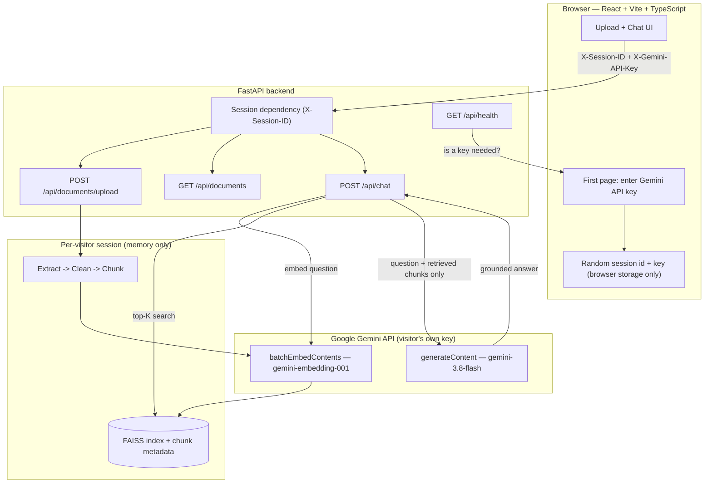

# AI Document Q&A — RAG Application (Gemini)

Upload PDF or TXT documents, ask questions in plain English, and get answers
generated **only** from your own documents — with citations to the exact file
and page. Built as a portfolio project that shows the fundamentals of
Retrieval-Augmented Generation (RAG) without unnecessary complexity: no
database, no queues, no agent frameworks.

Runs entirely on **Google's Gemini API** — one model family, one API key,
used for both steps of the pipeline (searching documents and writing
answers). It is also safe to host publicly: every visitor gets a **private,
in-memory document store** and uses **their own Gemini API key**, entered on
the first page.

## Table of Contents

- [Features](#features)
- [How it works](#how-it-works)
- [Architecture](#architecture)
- [Tech stack](#tech-stack)
- [Folder structure](#folder-structure)
- [Run it locally](#run-it-locally)
- [Getting a Gemini API key](#getting-a-gemini-api-key)
- [Configuration](#configuration)
- [Deploying for public use](#deploying-for-public-use)
- [API documentation](#api-documentation)
- [Testing](#testing)
- [Error handling](#error-handling)
- [Limitations & future improvements](#limitations--future-improvements)

---

## Features

- **Document upload** — PDF and TXT, validated for type, size, and emptiness
- **Sensible chunking** — overlapping chunks that keep document name, page number, and chunk ID
- **Gemini embeddings** (`gemini-embedding-001`) for search, **Gemini generation** (`gemini-3.8-flash` by default) for answers — one key covers both
- **FAISS similarity search** with configurable top-K
- **Grounded answers** — the model sees only retrieved chunks and is told to say so when the answer isn't there
- **Citations** — every answer lists document, page, similarity score, and an excerpt
- **Bring-your-own-key first page** — asks for a Gemini key only when the server doesn't already have one, with step-by-step instructions
- **Per-visitor isolation** — each browser session has its own private index; nothing is written to disk; idle sessions expire
- **Single-service deployment** — the backend serves the built frontend; a Dockerfile is included
- **Clean, responsive UI** with loading, error, and empty states
- **Small install** — no PyTorch, no local model download; the whole pipeline talks to Gemini over plain HTTP

## How it works

**Retrieval-Augmented Generation** fixes a core LLM limitation: a model only
knows its training data and whatever is in the prompt, so it can't see your
private documents. RAG bridges that in two phases.

**1. Indexing (once per document, at upload)**
```
PDF/TXT -> extract text -> clean -> split into chunks -> embed each chunk (Gemini) -> store in FAISS
```

**2. Retrieval + generation (once per question)**
```
question -> embed (Gemini) -> find the K most similar chunks in FAISS
         -> build a prompt containing ONLY those chunks
         -> ask Gemini to answer using just that context
         -> return the answer + which chunks (and pages) it came from
```

The key property: **Gemini never sees the whole document and is told never
to answer from general knowledge.** If the retrieved chunks don't contain the
answer it must say so, which is what keeps answers grounded and citable.

**One provider, one key, two jobs.** Turning text into vectors (*embeddings*)
and writing the final answer (*generation*) are separate API calls, but both
go through the same Gemini API key — unlike a mixed setup (e.g. OpenAI for
embeddings, Anthropic for answers), there's nothing to keep in sync.

## Architecture



Design choices:
- **No database.** Each visitor's `DocumentService` (FAISS index + metadata) lives in memory, keyed by a random session id. Sessions expire after inactivity and are capped in number, so memory stays bounded and no uploaded content touches the disk.
- **One key, header-based.** The Gemini key is sent as `X-Gemini-API-Key` per request, never stored server-side. If the server does have a key in its environment that's used as a fallback.
- **No agent framework.** LangChain is used only for its text splitter; the RAG pipeline is plain, explicit Python.
- **`IndexFlatIP` + normalized embeddings** means inner product equals cosine similarity, with exact (not approximate) search — right at this scale.
- **No PyTorch.** Both embeddings and generation are plain HTTPS calls to Gemini via `httpx`, so there's no large ML framework to install and nothing to download to disk.

## Tech stack

**Backend:** Python 3.10+, FastAPI, Pydantic, LangChain (`langchain-text-splitters`), FAISS, pypdf, httpx, pytest
**Frontend:** React 18, TypeScript, Vite, Tailwind CSS
**AI:** Google Gemini — `gemini-embedding-001` for search, `gemini-3.8-flash` for answers (both configurable)

## Folder structure

```
ai-document-qa/
├── backend/
│   ├── app/
│   │   ├── api/                 # routes: documents, chat, health, deps (session)
│   │   ├── services/            # chunking, embedding, vector_store, document,
│   │   │                        # session_manager, retrieval, llm — all Gemini-only
│   │   ├── models/  schemas/  utils/
│   │   ├── config.py            # environment-driven settings
│   │   └── main.py              # app entry; also serves the built frontend
│   ├── tests/
│   └── requirements.txt         # small — no PyTorch
├── frontend/
│   └── src/{components,pages,services,types}/
├── data/                        # only used if you enable disk persistence
├── Dockerfile  .dockerignore
├── .env.example  .gitignore  LICENSE  README.md
```

## Run it locally

You need Python 3.10+ and Node.js 18+. Use two terminals.

**Backend**
```bash
cd backend
python -m venv venv
source venv/bin/activate            # Windows: venv\Scripts\activate
pip install -r requirements.txt
cp ../.env.example .env             # Windows: copy ..\.env.example .env
uvicorn app.main:app --reload --port 8000
```
Check `http://localhost:8000/docs`. The install is small (FastAPI, FAISS,
pypdf, httpx, numpy) — no PyTorch, no model download.

**Frontend**
```bash
cd frontend
npm install
npm run dev                         # http://localhost:5173
```
Vite proxies `/api` to the backend, so no extra setup is needed.

**First page.** Leave `GEMINI_API_KEY` blank in `.env` and the app asks for
it on first load, with instructions built in. Or set it in `.env` and the
app skips straight to the main screen.

## Getting a Gemini API key

The first page shows these steps too.

1. Go to [aistudio.google.com/apikey](https://aistudio.google.com/apikey) and sign in with any Google account.
2. Click **Create API key** and choose a project (or let Google create one for you).
3. Copy the key that appears — it starts with `AI`.
4. Paste it into the app, or set `GEMINI_API_KEY` in `backend/.env`.

Gemini has a free tier that comfortably covers trying this project out; check
[ai.google.dev/pricing](https://ai.google.dev/pricing) for current limits if you plan heavier use.

## Configuration

Everything is set through environment variables; see [`.env.example`](./.env.example)
for the full annotated list (Gemini key/models, chunking, retrieval, upload
limits, session limits, CORS).

## Deploying for public use

### What is already handled
- **Isolation:** each browser gets a random session id; its documents live in a private in-memory index that other visitors can't query.
- **Cost:** visitors bring their own key, so you don't pay for their usage *as long as you leave `GEMINI_API_KEY` unset on the server*.
- **Bounded resources:** per-file size limit, per-session document limit, idle session expiry, and a cap on concurrent sessions.
- **Nothing on disk:** uploads are processed in memory and never saved.
- **Key never stored:** it arrives as a request header and is used for that call only.

### Deploy with Docker
```bash
docker build -t ai-document-qa .
docker run -p 8000:8000 ai-document-qa      # http://localhost:8000
```
The image builds the frontend and serves it with the API from one process, so
there is nothing to configure for CORS. Any host that runs containers works
(Render, Railway, Fly.io, Google Cloud Run, a VPS, ...). Set the port your
host expects via `$PORT` (already honoured).

> The Dockerfile was written carefully but **has not been built or run in
> this project's development sandbox** (no Docker there). The same steps —
> `npm run build`, then `uvicorn app.main:app` serving `frontend/dist` — were
> tested directly (see [Testing](#testing)). If the image build fails on your
> host, that path works without Docker.

### Without Docker
```bash
cd frontend && npm install && npm run build      # creates frontend/dist
cd ../backend && pip install -r requirements.txt
uvicorn app.main:app --host 0.0.0.0 --port 8000
```

### Must-read before going public
- **Run exactly one instance and one worker.** Sessions are held in that process's memory; a second instance or worker would not see the first one's sessions. On autoscaling hosts set max instances to 1. Restarts and redeploys clear all sessions (visitors just re-upload).
- **Use HTTPS.** The API key travels in a request header. Every mainstream host provides HTTPS by default; don't serve this over plain HTTP on the internet.
- **Don't put your own key on a public server** unless you intend to pay for everyone's usage.
- **Add rate limiting at your proxy/CDN** (e.g. Cloudflare, or your host's built-in limits). The app limits file size, documents per session, and concurrent sessions, but does not throttle request rate, and PDF parsing costs server CPU.
- **Memory:** each session's index is small, but 100 sessions × 10 large documents can add up. Tune `MAX_SESSIONS`, `MAX_DOCUMENTS_PER_SESSION`, `MAX_FILE_SIZE_MB`, and `SESSION_TTL_MINUTES` to your server size.
- **Browser-stored keys:** "Remember my key" saves it in the browser's localStorage, which any script on the same site could read. This app loads no third-party scripts, but users on shared computers should leave it unchecked (the key is then forgotten when the tab closes).

## API documentation

Interactive Swagger docs are at `/docs`. All endpoints except health require an
`X-Session-ID` header (16–64 characters: letters, digits, `-`, `_`); the
frontend generates one automatically.

| Header | Used by | Purpose |
|---|---|---|
| `X-Session-ID` | documents, chat | Selects the caller's private document store (required) |
| `X-Gemini-API-Key` | upload, chat | Overrides the server's `GEMINI_API_KEY`; used for both embedding and answering |

### `POST /api/documents/upload`
`multipart/form-data` with a `file` field (PDF or TXT). Returns `201`:
```json
{
  "document": {
    "document_id": "b3f1...", "filename": "architecture.pdf", "file_type": ".pdf",
    "num_chunks": 12, "num_pages": 5, "uploaded_at": "2026-09-28T10:15:00+00:00"
  },
  "message": "Document uploaded and indexed successfully."
}
```

### `GET /api/documents`
Lists the caller's documents: `{ "documents": [...], "total": 2 }`.

### `POST /api/chat`
Request: `{ "question": "What database does the system use?", "top_k": 4 }`
```json
{
  "answer": "The company uses PostgreSQL for storing application data.",
  "sources": [{
    "document_name": "architecture.pdf", "page_number": 4, "chunk_id": "a1b2...",
    "snippet": "...the application data is stored in PostgreSQL...", "similarity_score": 0.83
  }],
  "grounded": true
}
```

### `GET /api/health`
No session needed; never calls Gemini. The frontend uses it to decide whether to show the key screen:
```json
{
  "status": "ok", "llm_model": "gemini-3.8-flash", "embedding_model": "gemini-embedding-001",
  "api_key_required": true, "active_sessions": 3
}
```

## Testing

```bash
cd backend
pip install -r requirements.txt
pytest
```

| File | Covers |
|---|---|
| `test_text_extraction.py` | PDF/TXT extraction; corrupted and empty files |
| `test_chunking.py` | Chunk metadata, page boundaries |
| `test_vector_store.py` | FAISS add/search, top-K capping, no-disk mode, document removal |
| `test_embedding_service.py` | Gemini embeddings: per-call keys, batching, normalization, auth errors (mocked) |
| `test_llm_service.py` | Key resolution, request shape, safety-block handling (mocked) |
| `test_session_manager.py` | Isolation, TTL expiry, LRU eviction, invalid ids |
| `test_chat_and_upload_api.py` | Validation, session isolation, key header, citations |
| `test_health_api.py` | Health shape and key-requirement logic |
| `test_e2e_mock_gemini.py` | Real HTTP against a local mock Gemini server, in Gemini's actual request/response shape: visitor key reaches the API, only retrieved context reaches the model |

The full suite runs offline in a couple of seconds — no PyTorch, no network,
no real API key required. Beyond the test suite, the built frontend served
by the backend was also driven through a real browser (Playwright/Chromium)
against the mock Gemini server: key entry, upload, question, grounded
answer with sources, and isolation between two visitors — all with zero
JavaScript errors.

## Error handling

| Case | Behaviour |
|---|---|
| Unsupported type / empty / oversized file | `422` with a clear message |
| Too many documents in one session | `422` |
| Corrupted, password-protected, or scanned (no text) PDF | `422` with an explanation |
| Missing or malformed `X-Session-ID` | `400` |
| Missing Gemini key | `400`; the UI shows the key screen |
| Key rejected by Gemini (401/403) | `401` "rejected the API key"; the UI reopens the key screen |
| Gemini safety block | `502` naming the block reason |
| Question before any upload | `422` |
| Blank question | `422` |
| No relevant chunks / answer not in documents | `200`, `grounded: false`, "I couldn't find enough information..." |
| Other Gemini or network failures | `502` |

## Limitations & future improvements

- **Sessions are in memory:** they vanish on restart and don't scale across multiple instances. A shared store (Redis, or a database with per-user index files) would fix that.
- **No accounts or persistence:** documents are gone after the session expires.
- **No request-rate limiting** in the app itself.
- **Scanned PDFs** need an OCR step.
- **Streaming answers**, **re-ranking**, **per-document scoping**, and **document deletion in the UI** would be natural next steps (`VectorStore.remove_document` already exists and is tested).
- Gemini model names (`LLM_MODEL`, `EMBEDDING_MODEL`) change over time; update `.env` if a model is retired.

## License

MIT — see [LICENSE](./LICENSE).
